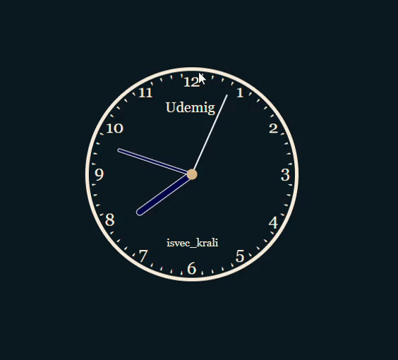

# Udemig-Clock

Apostraphy is related to the box but not the hour numbers, so if you resize the box of clockk so you have to change clock number 0ne-by-one. But apostraphy (seconds) automatically adjusted to the box of clock.

# Udemig.gif

